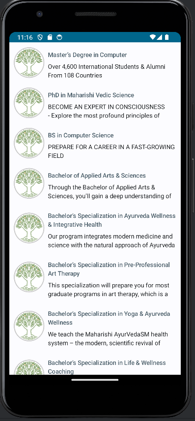
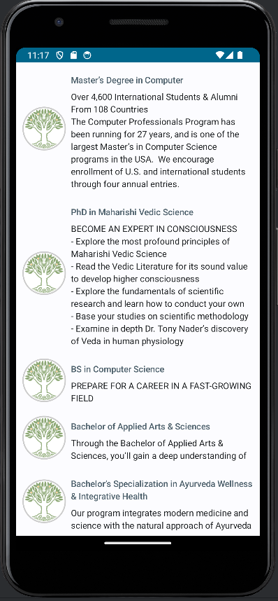

# Degree Program offered by Maharishi International University (MIU)

This repository contains the source code for an Android application that  display a list of degree programs offered by Maharishi International University (MIU). The app uses Jetpack Compose for UI and showcases a simple implementation of a lazy list with expandable items.

## Table of Contents
- [Features](#features)
- [Installation](#installation)
- [Usage](#usage)
- [Code Structure](#code-structure)
- [Screenshots](#screenshots)

## Features

- Display a list of degree programs.
- Expand and collapse program descriptions.
- Utilizes Jetpack Compose for a modern, declarative UI.

## Installation

1. **Clone the repository:**

   ```bash
   git clone https://github.com/ramessh-thapa/MDP_Lab_8.git


2. **Open the project in Android Studio:**
- Ensure you have the latest version of Android Studio installed.
- Open Android Studio and select File > Open... then navigate to the cloned repository.

3. **Build the project:**
- Click on the Build menu and select Make Project or press Ctrl+F9.

4. **Run the application:**
- Connect an Android device or start an emulator.
- Click the Run button or press Shift+F10.


## Usage

Once the application is installed and running:

- You will see a list of educational programs.
- Tap on any program to expand or collapse its description.


## Code Structure

The main components of the application are:

- MainActivity: The entry point of the application.
- Conversation: A composable function that displays a list of programs using LazyColumn.
- ProgramCard: A composable function that displays individual program details and handles expansion/collapse logic.
- Program: A data class representing the program information.


**MainActivity.kt**

```kotlin
package com.bright.listofmessages

import android.os.Bundle
import androidx.activity.ComponentActivity
import androidx.activity.compose.setContent
import androidx.compose.material3.MaterialTheme
import androidx.compose.material3.Surface
import androidx.compose.ui.Modifier
import androidx.compose.foundation.layout.fillMaxSize
import com.bright.listofmessages.ui.theme.ListOfMessagesTheme

class MainActivity : ComponentActivity() {
    override fun onCreate(savedInstanceState: Bundle?) {
        super.onCreate(savedInstanceState)
        setContent {
            ListOfMessagesTheme {
                Surface(
                    modifier = Modifier.fillMaxSize(),
                    color = MaterialTheme.colorScheme.background
                ) {
                    Conversation(samplePrograms())
                }
            }
        }
    }
}

```
**ProgramCard.kt**

```kotlin
@Composable
fun ProgramCard(prog: Program) {
    Row(
        modifier = Modifier
            .padding(8.dp),
            verticalAlignment = Alignment.CenterVertically
    ) {
        Image(
            painter = painterResource(id = R.drawable.miu_logo),
            contentDescription = "program logo",
            modifier = Modifier
                .clip(CircleShape)
                .size(70.dp)
                .border(width = 2.dp, shape = CircleShape, color = Color.LightGray)
        )
        var isExpanded by remember { mutableStateOf(false) }
        Column(
            modifier = Modifier
                .clickable { isExpanded = !isExpanded }
                .padding(start = 8.dp)
        ) {
            Text(
                text = prog.programName,
                color = MaterialTheme.colorScheme.secondary,
                style = MaterialTheme.typography.titleSmall
            )
            Text(
                text = prog.progarmDescription,
                style = MaterialTheme.typography.bodyMedium,
                maxLines = if(isExpanded) Int.MAX_VALUE else 2,
                modifier = Modifier.padding(top = 4.dp)
            )
        }
    }
}

```
**Conversation.kt**

```kotlin
@Composable
fun Conversation(programs: List<Program>) {
    LazyColumn {
        items(programs) { prog -> ProgramCard(prog) }
    }
}
```

**Program.kt**

```kotlin
data class Program(
    val programName: String,
    val progarmDescription: String
)
```

## Screenshots

**Normal View**




**Expanded View**




## Thank you!!


